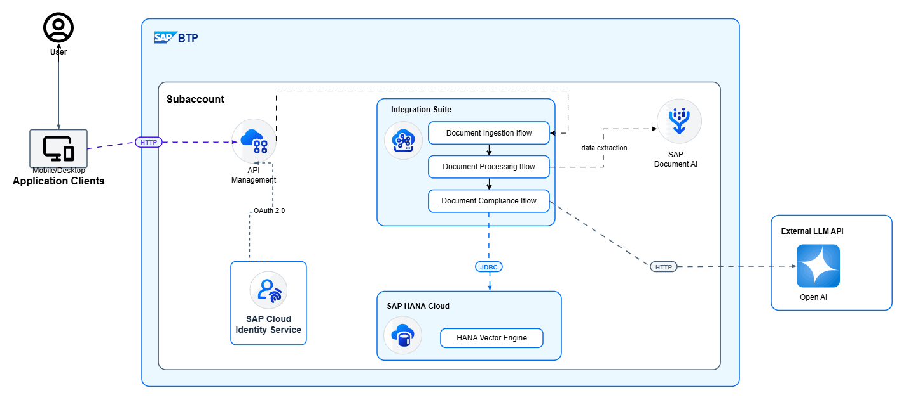
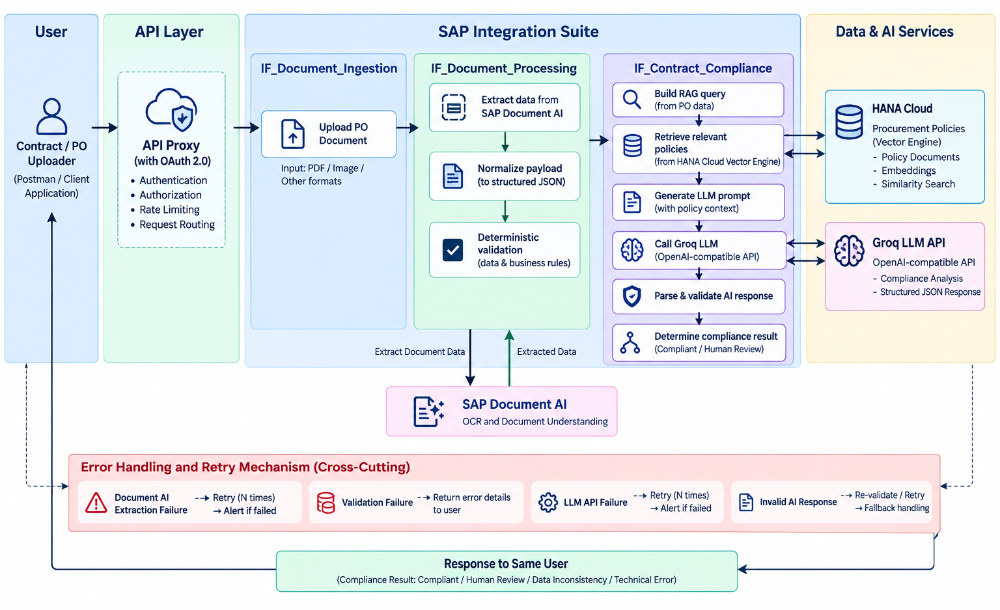

# AI Contract Compliance Automation

An SAP BTP solution for purchase-order document extraction, deterministic validation, procurement-policy retrieval, and AI-assisted compliance analysis.

## Architecture

## End-to-End Flow

1. The user uploads a PO or contract through the OAuth 2.0-protected API Proxy.
2. `IF_Document_Ingestion` receives the document.
3. `IF_Document_Processing` extracts data using SAP Document AI, normalizes the payload, and performs deterministic validation.
4. `IF_Contract_Compliance` builds the RAG query and retrieves relevant procurement policies from HANA Cloud Vector Engine.
5. The flow sends the normalized PO data and policy context to the Groq LLM API.
6. The AI response is parsed and validated.
7. The solution returns `PROCESS_PO`, `HUMAN_REVIEW`, `DATA_INCONSISTENCY`, or `TECHNICAL_ERROR`.

## Tech Stack

| Category | Technology |
|---|---|
| Platform | SAP BTP |
| Integration | SAP Integration Suite – Cloud Integration |
| API Management | API Proxy with OAuth 2.0 |
| Identity and Access Management | SAP Cloud Identity Services |
| Document Processing | SAP Document AI |
| Database | SAP HANA Cloud |
| Vector Search | SAP HANA Cloud Vector Engine |
| LLM Provider | Groq LLM API |
| API Format | OpenAI-compatible API |
| Scripting | Groovy |
| API Testing | Postman |
| Version Control | Git and GitHub |

## Setup

### 1. Configure SAP Cloud Identity Services

Configure SAP Cloud Identity Services for secure access to SAP Document AI.

1. Create or use an **Identity Authentication** service instance.
2. Configure the required technical client.
3. Enable OAuth 2.0 Client Credentials.
4. Maintain the client ID, client secret, token URL, and Document AI service URL.
5. Configure the required trust and role assignments.
6. Store the credentials securely in **SAP Integration Suite → Monitor → Security Material**.

### 2. Configure SAP Document AI

1. Create or identify the SAP Document AI service instance.
2. Configure the required project, schema, and document type.
3. Configure OAuth 2.0 authentication using SAP Cloud Identity Services.
4. Store the token URL, client ID, and client secret in Cloud Integration Security Material.
5. Configure the Document AI processing and status endpoints.
6. Validate authentication and endpoint connectivity before deploying the iFlows.

### 3. Import and Deploy the iFlows

Import the following artifacts into:

**SAP Integration Suite → Design → Integrations and APIs**

* `IF_Document_Ingestion`
* `IF_Document_Processing`
* `IF_Contract_Compliance`

#### iFlow Configuration Steps

For each iFlow:

1. Import the ZIP artifact.
2. Configure externalized parameters.
3. Review sender and receiver adapters.
4. Configure endpoint URLs, timeouts, and authentication.
5. Assign the required credentials and security material.
6. Configure error handling and retry behavior.
7. Save and deploy the iFlow.
8. Verify the deployment under **Monitor → Integrations and APIs**.

### 4. Configure HANA Cloud and JDBC

1. Create or use the SAP HANA Cloud database.
2. Execute the SQL scripts from the `database/` folder.
3. Create the procurement policy table and vector column.
4. Insert the procurement policies and generate embeddings.
5. Create a JDBC technical user with the minimum required privileges.
6. Configure the HANA Cloud JDBC connection in Cloud Integration.
7. Store the database credentials in Security Material.
8. Configure the JDBC receiver adapter in `IF_Contract_Compliance`.

#### Required JDBC Configuration

| Property                  | Description                         |
| ------------------------- | ----------------------------------- |
| **HANA Cloud Host**       | Database hostname                   |
| **SQL Port**              | HANA Cloud SQL port                 |
| **Database Name**         | Target database                     |
| **Username**              | JDBC technical user                 |
| **Password**              | Secure database password            |
| **JDBC Driver**           | Supported HANA JDBC driver          |
| **Connection Properties** | Required HANA connection parameters |

#### SQL Operations

Configure separate SQL operations for:

* Policy insertion
* Embedding generation
* Vector similarity search
* Relevant policy retrieval

Verify that the JDBC user can execute the required SQL statements and that vector search returns relevant procurement policies.

### 5. Configure Groq LLM API

1. Create a Groq API key.
2. Store the key securely in Cloud Integration Security Material.
3. Configure the Groq OpenAI-compatible endpoint.
4. Configure the selected model and request headers.
5. Send the normalized PO JSON and retrieved policy context.
6. Validate the response against the expected JSON structure.
7. Configure timeout, exception handling, and retry behavior.

> **Security Note:** Do not hardcode the API key in Groovy scripts, message bodies, or Git files.

### 6. Configure API Providers

Create the API provider before creating the API proxy.

#### 6.1 Cloud Integration API Provider

1. Create an API provider for the Cloud Integration runtime.
2. Configure the Cloud Integration base URL.
3. Configure authentication and connectivity.
4. Test the provider connection.
5. Use the provider as the backend target for the API proxy.

#### 6.2 Document Compliance API Provider

1. Create an API provider for the deployed document compliance endpoint.
2. Configure the correct backend URL.
3. Configure authentication and connectivity.
4. Test the provider connection.
5. Associate it with `Document_Compliance_Interface`.

### 7. Configure the API Proxy and OAuth 2.0

Configure the API proxy after the required API provider has been created.

1. Create or import the `Document_Compliance_Interface` API proxy.
2. Select the configured API provider as the backend target.
3. Configure the proxy base path and endpoint routing.
4. Apply the OAuth 2.0 policy.
5. Configure the API product and application.
6. Configure the client ID, client secret, scopes, and token endpoint.
7. Configure `GenerateAccessToken` if required.
8. Deploy the API proxy.
9. Generate an access token using the OAuth 2.0 Client Credentials flow.
10. Use the bearer token when calling the protected API.

#### OAuth 2.0 Validation

Validate the association between:

* API provider
* API proxy
* API product
* Application
* OAuth policy

### 8. Import and Configure Postman

#### 8.1 Import the Postman Collection

1. Open Postman.
2. Select **Import**.
3. Import the collection JSON file from the `postman/` folder.
4. Import the environment JSON or sanitized environment template.
5. Select the imported environment.

#### 8.2 Configure Environment Variables

Configure the required variables:

| Variable        | Description                  |
| --------------- | ---------------------------- |
| `base_url`      | Base URL of the API          |
| `token_url`     | OAuth 2.0 token endpoint     |
| `client_id`     | OAuth client ID              |
| `client_secret` | OAuth client secret          |

#### 8.3 Execute and Validate API Requests

1. Execute the OAuth 2.0 token request.
2. Pass the bearer token to the protected API.
3. Execute the PO upload request.
4. Verify the document processing and compliance response.

## Validation Scenarios

- Valid PO with no policy violations
- Payment terms exceeding the allowed limit
- Invalid currency
- Invalid delivery lead time
- Line-item amount mismatch
- PO total mismatch
- Approval threshold exceeded
- Missing mandatory fields
- Document AI extraction failure
- Groq API failure
- Invalid AI response
- RAG retrieval failure

